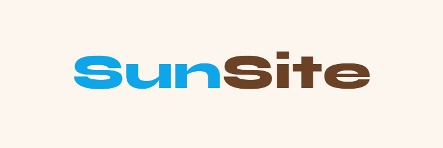

# 💫 About Me:
# 👋 Hi, I'm Mukeshwaran  I'm a **Python developer and AI/automation enthusiast** interested in building practical software that can automate tasks and interact with computers intelligently.  **Explore my repositories, star the projects you find useful, and follow along as I build new things with AI and automation.**  If you find something interesting, **feel free to open an issue, suggest an improvement, or contribute** — let's build something awesome together! 🚀  **⭐ Star a repository • 🍴 Fork it • 💡 Share an idea • 🤝 Contribute** 

## ☀️ SunSite:

Websites & AI automation for small businesses → **[sunsite-org.netlify.app](https://sunsite-org.netlify.app)**

## 🌐 Socials:
    

# 💻 Tech Stack:
                               
# 📊 GitHub Stats:
 
 

### ✍️ Random Dev Quote

### 🔝 Top Contributed Repo

---

<!-- Proudly created with GPRM ( https://gprm.itsvg.in ) -->
